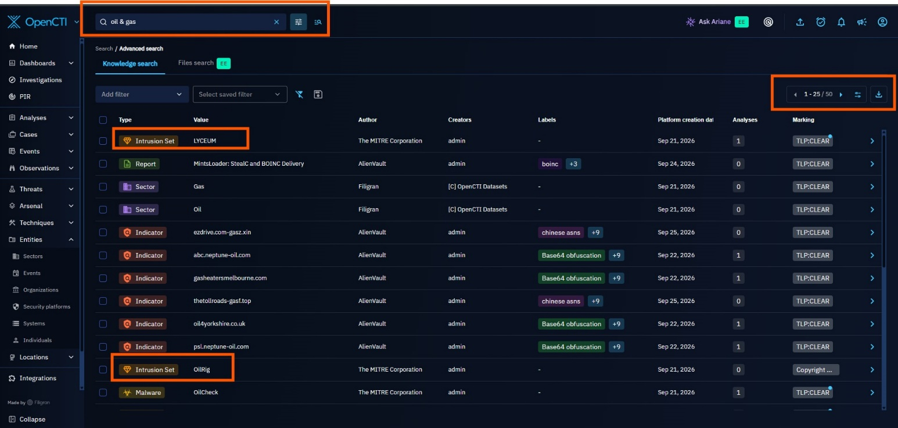
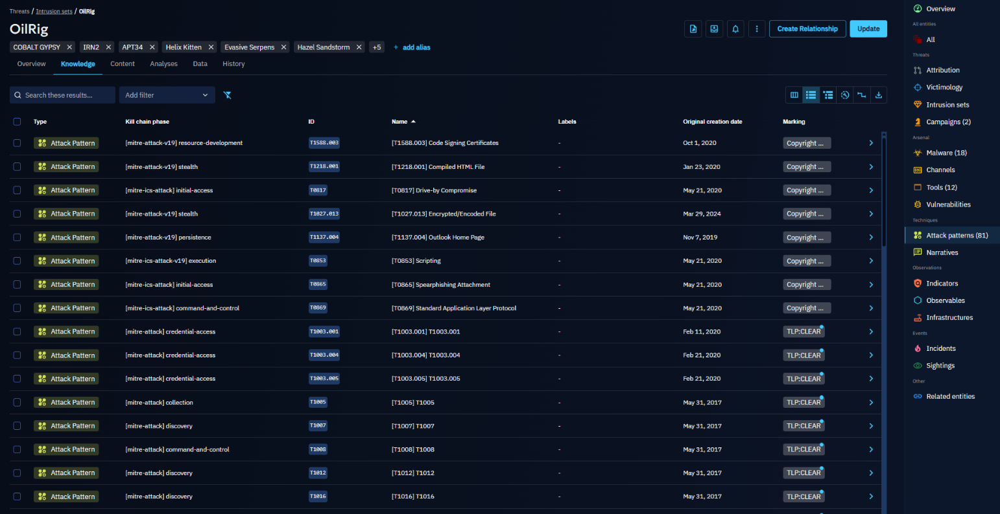
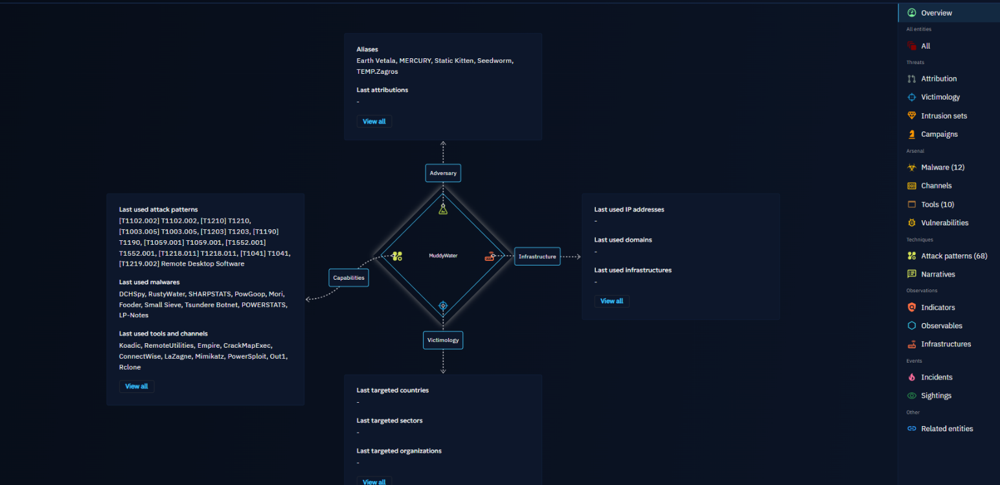
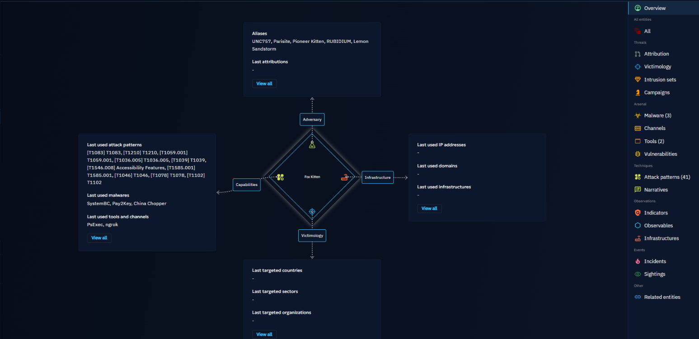
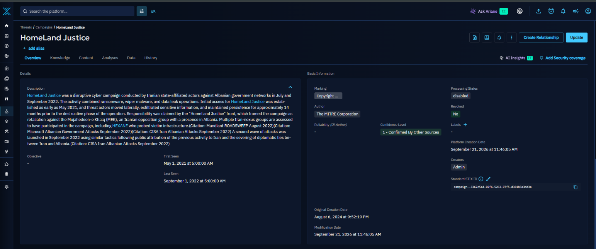
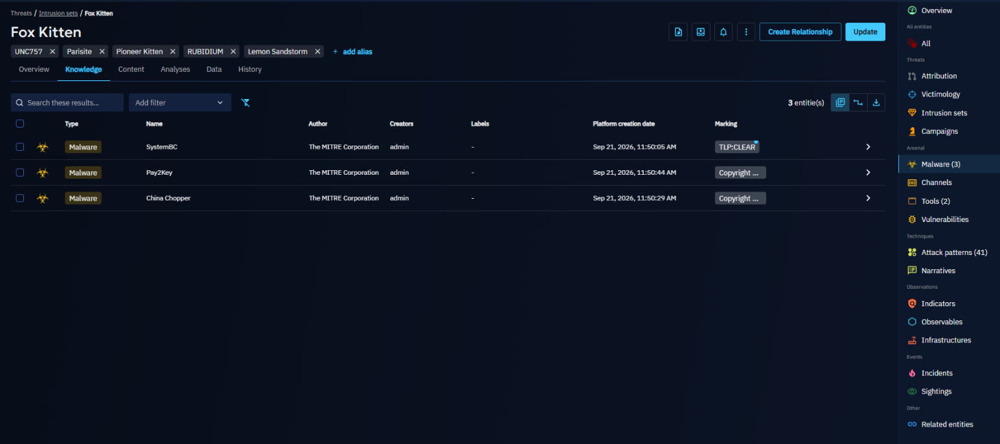
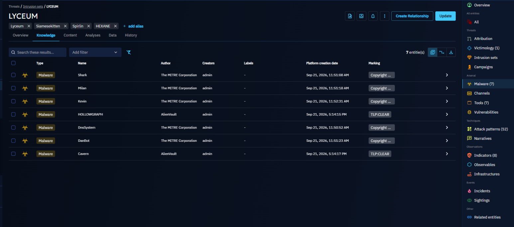
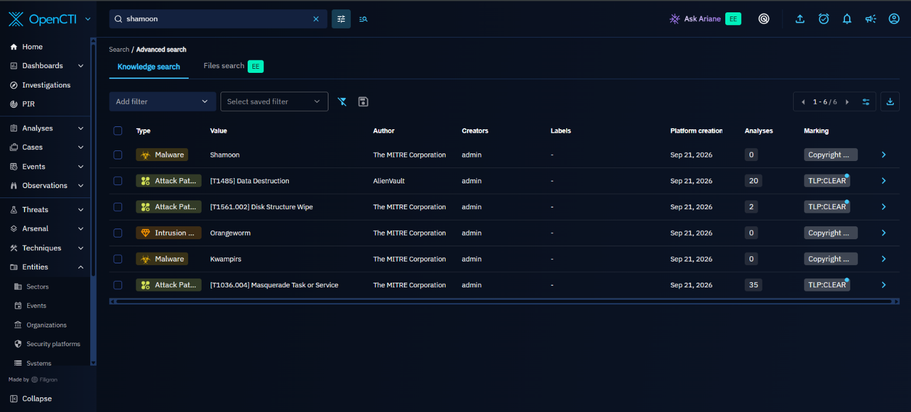
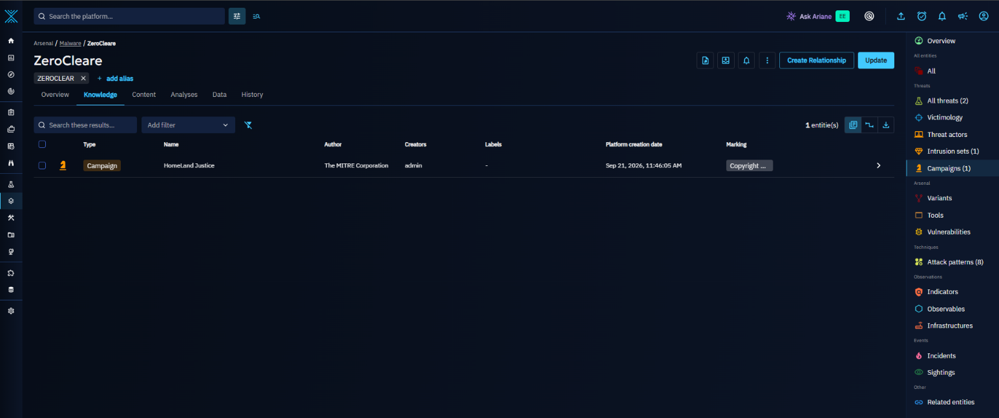

# 1\. Industry Sector Focus: Desert Oil

Desert Oil was mapped to the Oil & Gas / Energy sector within OpenCTI. This is the closest match to Desert Oil real-world operational profile as an integrated national oil and gas company engaged in exploration, production, refining, and petrochemical distribution. I did a Global Search using the Keyword “oil and gas” from the image below.

**

# 2\. Threat Landscape Analysis

Because the Sector entity had no populated relationships, this landscape analysis was built bottom-up from Intrusion Set entities in OpenCTI, filtered to groups with a documented Oil & Gas / Energy sector match and a documented history of targeting Saudi Arabia or the wider Middle East.

Four actors met both criteria and are covered in full below: OilRig, MuddyWater, Fox Kitten, and HEXANE. Candidates considered and ruled out as insufficiently relevant to Desert Oil's sector/region profile: Andariel, HellCat, Morpheus, and Ke3chang.

## 2.1 Top Threats, Actors, and Campaigns Affecting the Sector

The table below summarizes the four confirmed threat actors

| **Actor** | **Also Known As** | **Suspected Sponsor** | **Core Focus** |
| --- | --- | --- | --- |
| OilRig | APT34, Helix Kitten, Hazel Sandstorm, Earth Simnavaz, Crambus | Iranian state intelligence | Long-running espionage against Saudi energy/government orgs since 2016; collaborated on the 2019 ZeroCleare wiper against the regional energy sector. |
| MuddyWater | Static Kitten, Seedworm, MERCURY, Mango Sandstorm | Iranian Ministry of Intelligence and Security (MOIS) | First publicly documented after a 2017 campaign that hit Saudi Arabia directly; continues phishing and trusted-relationship campaigns across the region into 2026. |
| Fox Kitten | Overlaps/cooperates with APT33, APT39; tracked by Dragos as "Parisite" | Iranian state-sponsored | Mass-exploits VPN/remote-access flaws across oil & gas and IT/telecom; named Saudi Arabia among its 2020-disclosed victim countries; now also brokers access to ransomware crews. |
| HEXANE | Lyceum,Siamesekitten, Spirlin | Iranian-nexus | Purpose-built oil & gas and telecom/ISP targeting across the Middle East and Africa, explicitly naming Saudi Arabia among its victim countries. |

### OilRig (APT34 / Helix Kitten)

OilRig is one of the longest-running and most prolific Iranian cyber-espionage groups, active since at least 2014 and assessed to work on behalf of Iranian state intelligence. It has targeted financial, government, energy, chemical, and telecommunications organizations, with a strong and repeated focus on Saudi Arabia and the wider Middle East. A defining trait is its use of supply-chain and trusted-relationship attacks compromising one organization to reach another it trusts.

**Campaigns & targeting history vs. oil & gas / Saudi Arabia**

-   2016: The original "OilRig Campaign" delivered the Helminth backdoor specifically against Saudi Arabian organizations.
-   2019: OilRig collaborated on the destructive portion of the ZeroCleare wiper attack, which targeted the energy sector in the Middle East.
-   2025: Sustained cyber-espionage campaigns against energy and defense companies across Europe and the Middle East, using compromised Microsoft 365 accounts and Azure infrastructure for persistence.

**Notable malware/tools & initial access**

-   Initial access: spear-phishing (malicious attachments and links) from compromised or spoofed email accounts; fake VPN portals, conference sign-up pages, and job-application websites; spearphishing via LinkedIn; exploitation of known CVEs (e.g., CVE-2017-11882, CVE-2024-30088).
-   Notable tools/malware: Helminth, QUADAGENT, OopsIE, BONDUPDATER, RGDoor, SideTwist and Mango backdoors, the cloud-service-powered OilBooster/OilCheck/ODAgent downloader family, plus credential tools LaZagne, Mimikatz, and the custom PICKPOCKET and VALUEVAULT stealers.
-   Persistence favors legitimate channels: abusing the Outlook Home Page feature, scheduled tasks, and web shells, which blend into normal administrative activity.

### MuddyWater

MuddyWater is assessed to be a subordinate element of Iran's Ministry of Intelligence and Security (MOIS), active since at least 2017. It targets government agencies, telecommunications operators, defense organizations, universities, and oil & gas companies across the Middle East, Asia, Europe, Africa, and North America.

Its targeting aligns closely with Iranian geopolitical and diplomatic intelligence priorities.

**Campaigns & targeting history**

-   November 2017: The cluster later named MuddyWater was first publicly documented after campaigns that struck organizations directly in Saudi Arabia, Iraq, Israel, the UAE, Georgia, India, Pakistan, Turkey, and the US.
-   2025–2026: Continued phishing via compromised mailboxes across the Middle East and North Africa "Operation Olalampo" disclosed by Group-IB (Feb 2026); expansion into trusted-relationship compromises and wider maritime, aviation, and financial targeting using newer Rust-based malware
-   2025: Use of the DCHSpy Android surveillance tool during the Israel,Iran conflict, illustrating the group's willingness to pivot tooling around active regional conflict.

**Notable malware/tools & initial access**

-   Initial access: spear-phishing with malicious Word documents/PDFs; exploitation of public-facing applications; password spraying against Outlook Web Access and SMTP; and, increasingly, compromise via trusted third parties.
-   Notable tools: Mimikatz, LaZagne, and "Browser64" for credential theft; the PowerShell-based PRB-Backdoor; the "BlackWater" campaign toolset; Dindoor malware. In 2026, researchers found exposed MuddyWater C2 infrastructure on a Netherlands-based VPS, revealing scripts, victim data, and operational logs.

### Fox Kitten

Fox Kitten (G0117) is an Iranian state-sponsored group, FBI-confirmed active since at least 2017. Rather than a single narrow target set, it targets IT, telecommunications, oil & gas, aviation, government, and security sectors broadly, using compromised organizations (especially IT/telecom providers) as stepping stones to reach thousands of further downstream victims.

**Campaigns & targeting history vs. oil & gas / Saudi Arabia**

-   2020: ClearSky's original public disclosure of the Fox Kitten campaign listed Saudi Arabia among the countries targeted, alongside Israel, the US, Lebanon, Kuwait, the UAE, and several European states; oil & gas was named as a core targeted sector alongside IT, telecom, and aviation.
-   2019–2020: Iranian state actors assessed with medium-high confidence to overlap with this same infrastructure used ZeroCleare and Dustman disk-wiping malware against energy and industrial-sector organizations in the region.
-   2024: A joint CISA/FBI/DC3 advisory formally confirmed Fox Kitten facilitates ransomware attacks by selling initial access and domain-level credentials to ransomware affiliates in exchange for a cut of the ransom, while concealing its Iranian origin from its criminal "customers."

**Notable malware/tools & initial access**

-   Signature initial access: rapid, large-scale exploitation of one-day/N-day vulnerabilities in internet-facing VPN and remote-access appliances, historically Pulse Secure Connect (CVE-2019-11510), Fortinet FortiOS (CVE-2018-13379), Palo Alto GlobalProtect (CVE-2019-1579), and Citrix ADC (CVE-2019-19781) often within hours to days of public disclosure.
-   Post-exploitation: RDP tunneled over SSH via the custom POWSSHNET backdoor, privilege escalation with Juicy Potato, and a range of self-developed 32-/64-bit implants and socket-based backdoors.
-   Because Fox Kitten's initial-access method (VPN/remote-access exploitation) is opportunistic and vulnerability-driven rather than sector-specific, any internet-facing Desert Oil VPN or remote-access appliance is a plausible entry point regardless of its industrial context.

### HEXANE (Lyceum)

HEXANE; also tracked as Lyceum or Siamesekitten is a cyber-espionage group active since at least 2017, deliberately tracked as a separate entity from OilRig/APT33 despite similar TTPs, because of differences in its victims and tooling. It is one of the more narrowly purpose-built groups on this list:

It focuses specifically on oil & gas, telecommunications, aviation, and internet-service-provider organizations in the Middle East and Africa.

**Campaigns & targeting history vs. oil & gas / Saudi Arabia**

-   MITRE ATT&CK and multiple vendor reports (Dragos, Secureworks, ClearSky) explicitly list Saudi Arabia among HEXANE's targeted countries, alongside Israel, Kuwait, Morocco, and Tunisia.
-   2019: After roughly a year of toolkit development and testing against public malware-scanning services, HEXANE launched a dedicated campaign against oil & gas businesses in the Middle East, the clearest single example, of the four actors profiled, of a group explicitly building a capability aimed at this sector.
-   Its parallel targeting of telecom and ISP organizations is assessed as a possible stepping stone toward network-level man-in-the-middle access, relevant to Desert Oil to the extent it depends on regional telecom/ISP providers for connectivity.

**Notable malware/tools & initial access**

-   Initial access: spear-phishing with malicious documents.
-   Notable tooling: the custom DanBot remote-access trojan, DNS tunneling for command and control, and credential-harvesting utilities.

**2.2 Commonly Observed Malware/Tools and Techniques (MITRE ATT&CK TTPs)**

| **Actor** | **Notable Malware / Tools** | **Primary Purpose** |
| --- | --- | --- |
| OilRig | Helminth, QUADAGENT, OopsIE, BONDUPDATER, RGDoor, SideTwist, Mango backdoors; OilBooster/OilCheck/ODAgent downloader family; LaZagne, Mimikatz, PICKPOCKET, VALUEVAULT | Custom backdoors and cloud-based downloaders for persistence; credential-theft utilities for lateral movement |
| MuddyWater | Mimikatz, LaZagne, Browser64; PRB-Backdoor; BlackWater toolset; Dindoor; DCHSpy (Android) | Credential theft; PowerShell-based backdoors; mobile surveillance during active regional conflict |
| Fox Kitten | POWSSHNET (RDP-over-SSH backdoor); Juicy Potato; custom socket-based backdoors (STSRCheck, Port.exe) | VPN/remote-access exploitation, privilege escalation, and covert tunneling for persistent access |
| HEXANE | DanBot custom RAT; DNS-tunneling C2 utilities; credential harvesters | Purpose-built remote access and covert command-and-control against oil & gas / telecom targets |

**MITRE ATT&CK technique mapping**

| **Tactic** | **Technique (ID)** | **Actor(s)** | **How it's used** |
| --- | --- | --- | --- |
| Reconnaissance / Resource Dev. | Phishing for Info; Acquire/Compromise Infrastructure (T1598, T1583/T1584) | All four | Fake VPN portals, job-application sites, and compromised legitimate mailboxes/servers set up in advance of a campaign. |
| Initial Access | Phishing: Spearphishing Attachment/Link (T1566.001/.002) | OilRig, MuddyWater, HEXANE, (Fox Kitten opportunistically) | Malicious Office documents, PDFs, or links delivered to specific individuals. |
| Initial Access | Exploit Public-Facing Application (T1190) — esp. VPN/remote access (CVE-2019-11510, CVE-2018-13379, CVE-2019-1579, CVE-2019-19781) | Fox Kitten (signature technique); MuddyWater | Rapid mass-scanning and exploitation of unpatched VPN/firewall appliances, often within hours of a CVE going public. |
| Initial Access | Trusted Relationship / Supply Chain Compromise (T1195, T1199) | OilRig, MuddyWater | Compromising a trusted vendor, partner, or IT service provider to reach the real target. |
| Initial Access | Valid Accounts / External Remote Services (T1078, T1133) | All four | Reuse of stolen or brute-forced credentials against VPN, OWA, and remote-access services. |
| Execution | Command & Scripting Interpreter: PowerShell, VBScript, Windows Command Shell (T1059.001/.003/.005) | All four | Macro-driven droppers and PowerShell-based downloaders/backdoors are the dominant execution method. |
| Persistence | Scheduled Task/Job (T1053.005); Office Application Startup: Outlook Home Page (T1137.004) | OilRig, MuddyWater, HEXANE | Re-launches implants on a schedule or on Outlook startup — designed to blend into routine admin activity. |
| Credential Access | OS Credential Dumping (T1003); Credentials from Password Stores (T1555); Brute Force / Password Spraying (T1110) | All four | Widespread reuse of Mimikatz and LaZagne; MuddyWater specifically favors password spraying against OWA/SMTP. |
| Discovery | System/Network Configuration & Account Discovery (T1082, T1016, T1087) | OilRig, HEXANE | Native Windows commands (whoami, ipconfig, net user/group) used for low-noise reconnaissance post-compromise. |
| Command & Control | Application Layer Protocol: Web/DNS (T1071.001/.004); DNS Tunneling | All four | HTTP(S) and DNS-based C2 predominate; HEXANE relies heavily on DNS tunneling specifically. |
| Exfiltration | Exfiltration Over C2 Channel / Alternative Protocol (T1041, T1048) | OilRig, Fox Kitten | Data pushed out over the same C2 channel or separately via FTP/mail protocols. |
| Impact (historical) | Disk Wipe: Disk Structure Wipe (T1561.002) | OilRig (ZeroCleare, collaborator); infrastructure overlap with Fox Kitten (Dustman) | Destructive wiper deployment against Middle East energy-sector targets — the escalation path this sector has already experienced once, in 2019. |

## 2.3 Patterns of Targeting

### Preferred victims

-   Government, energy/oil & gas, and telecommunications/ISP organizations recur across all four actors as either primary targets or as stepping-stone targets used to reach further victims.
-   IT service providers and other third parties are deliberately targeted as a path into their better-defended clients directly relevant to Desert Oil given the scale of vendor and contractor relationships typical of a national oil company.

### Initial access methods, ranked by how often they recur

-   Spear-phishing (malicious attachment or link); used by all four actors and the single most common entry point across Iran-nexus activity in this sector.
-   Exploitation of internet-facing VPN/remote-access infrastructure; Fox Kitten's defining technique, and one that does not require a phishing click at all, making patch management on perimeter devices a top-tier control.
-   Compromise of a trusted third party or supply-chain partner, OilRig and MuddyWater's preferred route into harder targets.
-   Credential reuse / password spraying against externally exposed services (OWA, SMTP, VPN) a lower-cost, high-volume technique layered on top of the above.

## 2.4 Notable Industry Alerts, Warnings & Historic Incidents

| **Date** | **Incident / Advisory** | **Attribution** | **Summary** |
| --- | --- | --- | --- |
| Aug 2012 | Shamoon (Disttrack) wiper attack on Saudi Aramco | "Cutting Sword of Justice"; widely assessed as Iran-aligned | Wiped data on roughly 30,000–35,000 Aramco workstations, overwriting drives with an image of a burning flag; corporate IT took about two weeks to fully recover, though isolated production/control networks were unaffected. |
| Nov 2016 – 2017 | Shamoon 2.0 | Iran-aligned (assessed) | A resurgent Shamoon variant hit multiple Saudi organizations again, showing the malware family's persistence as a threat to the same target set. |
| Dec 2018 | Shamoon variant vs. Saipem | Iran-aligned (assessed) | Saipem, an Italian oil & gas contractor with major Saudi Arabian operations, was hit by a further Shamoon-linked wiper. |
| Dec 2019 | ZeroCleare wiper | OilRig assessed as collaborator on the destructive component | A new destructive wiper targeted energy-sector organizations in the Middle East, reusing infrastructure overlapping with the Fox Kitten campaign. |

